定制属于自己的Java代码生成器(当然其他语言也可以),从JFinal-Code-Online Platform(JCOP)开始!!

JCOP是一个轻量级的代码生成器内核,可加入一切自己想生成的文件的模板,绝对的灵活自由,你值得拥有!!

JCOP基于Java,JFinal开发,是一个标准java web项目，使用时不依赖任何IDE，其核心设计目标是学习简单,扩展自由.

可用任何模板引擎生成一切代码,目前默认提供Java代码生成器,支持JFinal Web风格项目,不久将加入传统的SSH项目生成.

代码量1000余行,实现了模板生成器的核心功能.

Features
===

- 基于业务模型快速生成，大大提高开发速度。
- 不引入新的规范新的技术，和已有的开发模式相同，是已有开发模式的补充。
- 生成的源代码和生成器模板，均可自由修改，并能很容易的加入新的模板
- 基础框架可按照已有的技术框架任意组合，不会将用户绑到特定的框架.
- 容易上手，无论是学习还是作用项目开发，平台容易掌握，学习曲线低。

Quick Start
===

构建(或下载)并运行jcop.war
---

<a href="http://code.jfinal.com/jcop.war">下载jcop.war</a>

<a href="http://code.jfinal.com/jcop.sql">下载jcop.sql</a>

如果你对源码有兴趣请从github或者oscgit下载源码构建.

源码地址:

github

    git clone https://github.com/b1412/jfinal-code-online.git

oscgit

    git clone https://git.oschina.net/zhouleib1412/jfinal-code-online.git

如果你是gradle用户(2.0以上),请直接执行gradle war构建项目.

如果你没使用gralde,执行项目跟路径下的脚本,windows用户执行

      gradlew.bat

linux用户执行

      gradlew

自动下载gralde完成后,执行 gradlew war构建项目(首次构建需要在中心库下载依赖,速度较慢)构建成功后如下位置找到war

     build/libs/jcop.war

如果想将项目导入IDE调试,eclipse用户执行

     gradlew eclipse

idea用户执行

     gradlew idea

启动项目
---

 将jcop.war复制到任何servlet容器(如tomcat,jetty)并启动

 特别注意:需要先修改war中数据库用户密码配置为自己的数据库用户密码,否则启动失败.

 可以直接解压war包修改配置再启动.

 或者第一次忘记修改启动失败后再修改解压出来的配置文件.

 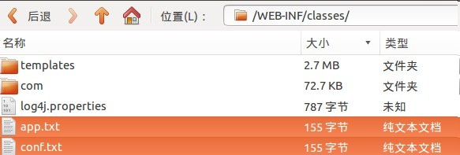

 访问项目主页 <a href="http://localhost:8080/jcop">http://localhost:8080/jcop</a>
 (8080为容器默认端口,可以自己修改),显示如下

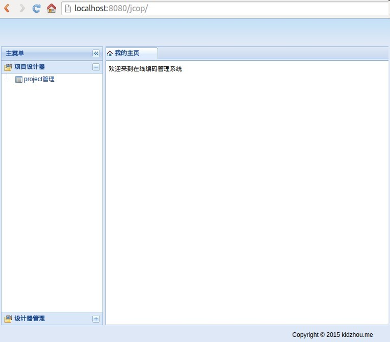

创建项目
---

点击左侧菜单的"project管理",显示如下图:

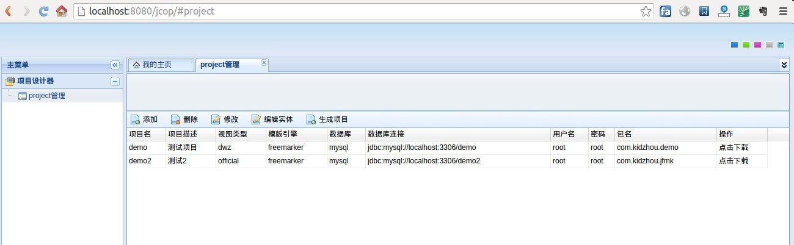

点击project管理列表页工具栏上的"添加",填入测试数据,显示如下图:

保存测试数据回到"project管理"列表页,显示如下图:

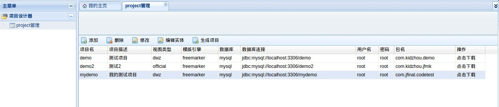

创建实体
---

点击"project管理"列表页工具栏上的"编辑实体",填入测试数据,显示如下图:

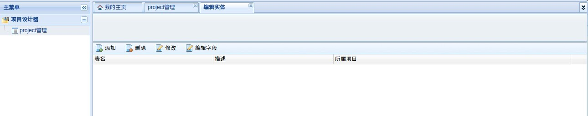

点击"编辑实体"列表页工具栏上的"添加",填入测试数据,显示如下图:

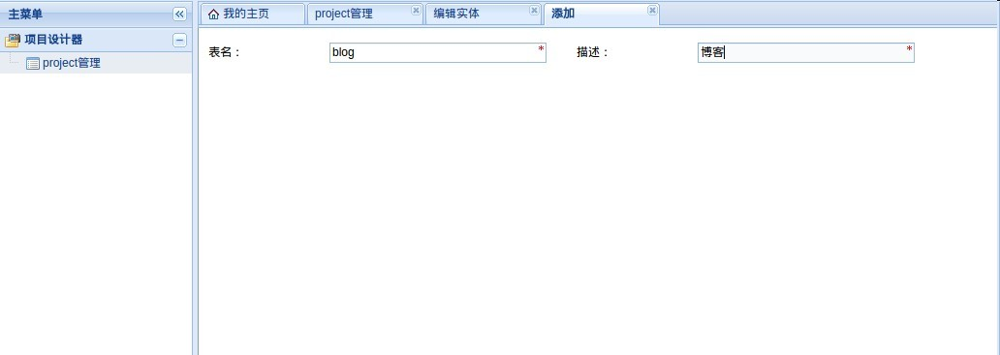

保存测试数据回到"编辑实体"列表页,显示如下图:

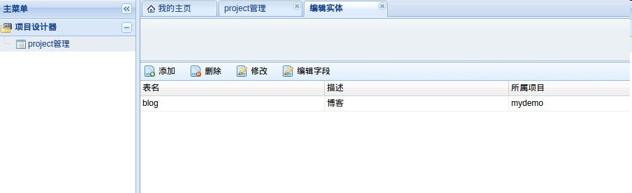

创建字段
---

点击"编辑实体"列表页工具栏上的"编辑字段",填入测试数据,显示如下图:

点击"编辑字段"列表页工具栏上的"添加",填入测试数据,显示如下图:

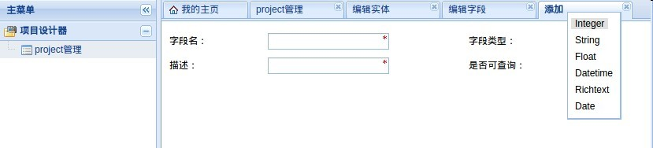

保存测试数据回到"编辑字段"列表页,显示如下图:

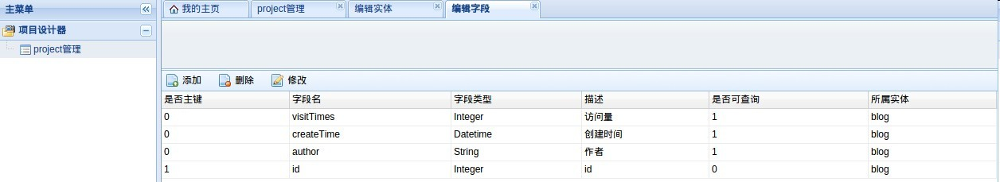

生成项目
---

回到"project管理"列表页,选择刚编辑的项目,点击"生成项目",显示如下图:

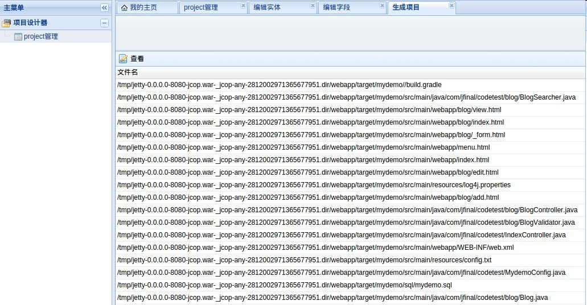

生成项目代码在:

/src/main/webapp/target/YourProject

在线浏览代码
---

双击任何一个生成的文件,则可在线查看源代码

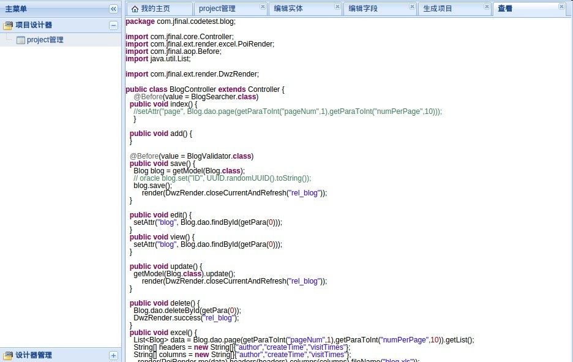

在线预览项目,一边生成一边看效果(不依赖IDE)(敬请期待...)
---

基于生成的代码继续开发,一边生成一边看效果(依赖IDE)
---

- 用你熟悉的IDE(eclipse,idea等)导入刚生成的项目 /src/main/webapp/target/YourProject

- 根据你选择的构建方式(gradle或maven)本身配置的方式配置好项目,按照JFinal推荐的方式进行开发,
(<a href="http://www.jfinal.com/download?file=jfinal-1.8-manual.pdf">JFinal手册</a>第一章)
就能一边用jcop生成代码,一边看到效果!

反向工程(敬请期待...)
===

如果已经设计好了数据库,从数据库schema导入生成project

JCOP为谁而设计?
===

JFinal初学者
---

对于个人来说通过对JCOP开源平台的学习(因为JCOP本身就是主流框架的一个容器),
可以快速的提升自己对JFinal完整项目的熟悉,快速熟悉JFinal中各种常用功能,不同于一般的学习demo的一点是,
使用JCOP,初学者可以迅速搭建自己的业务demo并查看符合jfinal项目风格的代码.

以JFinal为核心框架进行开发的团队
---

JCOP是程序员为程序员开发的一个工具,它的开发模式与传统开发模式完全相同.如果团队leader决定采用JFinal作为web开发核心技术,
那么使用JCOP将能大大减少重复开发,并降低团队新成员的学习成本.核心程序员开发业务模板,新手则可以用JCOP进行业务代码生成,并能
尽快的熟悉团队已有的开发方式和规范

想开发代码生成器的人(包括非JFinal用户,如传统的SSH用户)
---

稍微有一定开发经历的人一定都对重复业务逻辑的开发深恶痛绝,很多团队除开基本CRUD都有自己常用的一些业务功能模块,
一般的生成工具并没有提供功能,更重要的是如果想修改和加入自己的功能有很大学习成本(如学习eclipse plugin开发).
而JCOP则可以完全靠web前端技术来扩展自己想要的一切,或者也可以把JCOP仅仅看做是一个基于web的生成器雏形,非常容易
的用来做二次开发.

为什么选择JCOP
===

模型化重复功能
---

JCOP的目的就是通过平台模型化(生成器模板)常用功能,CURD,数据校验等,从而提高开发效率，让软件工程师将主要的精力放
在最核心的个性化的业务逻辑上，而非不断的重复已经实现无数次的逻辑.在这点上JCOP本身并没有提供太多功能,因为这个功
能很多平台都已经实现过很多,为用户考虑很多但是对于不同用户可能需求是不同的,平台不自作主张提供大而全的模板,未来有
精力模板会不断增多,但是和内核本身是完全独立的,内核本身也会不断发展包容更多的扩展

完全开放
===

JCOP源代码完全开发,生成器模板完全开放,可以轻松的加入自己的模板,可以定制适合自己团队的开发规范.所以当使用JCOP
时候并不会抛弃团队以前的积累和技术架构,而是为已有的技术积累引入了一个快速建模的工具.JCOP也是一个JFinal开源框
架很好的学习工具，因为它本身是一个设计良好的JFinal项目.虽然目前支持的技术有限,但是熟悉其他技术的开发者可以轻
松的将自己熟悉的框架技术加入平台．这也是JCOP设计的核心目标之一.不同与一些以模型为驱动的业务平台产品有自己的
开发规则、脚本语言与操作方式成为了一个自封闭的系统。

不依赖IDE
---

一些功能齐全的平台都依附于特定的IDE,如作为一个eclipse plugin存在,在操作是更加方便,但是却增加了开发和使用的复杂度.
JCOP不开发自己的IDE,也不开发插件,只作为一个普通的标准的web项目存在,这样就算是用户对UI有自己的需求只要懂web前端开发,
就可以在现有基础上轻松扩展,甚至完全换一套自己的UI.
如果平台依赖与某IDE,那么扩展平台UI则会难度极大,非新手可以驾驭.

提高速度
---

JCOP采用元数据驱动代码生成的方式,生成数据库脚本、Java代码、页面模板,配置文件等所有文件(可以再加入任何你需要生成的文件).
从而使您从枯燥繁琐的仪式性的Java代码（如Model,常规CRUD）中解放出来,专注于核心的业务逻辑.
JCOP平台底层是一个设计良好的框架，可以提供对不同框架间的一站式快速搭建。
JCOP的关注点主要集中在如何降低初学者的上手难度,简化平台本身的学习成本,不断优化内核如何让整个团队能在最短时间内掌握整个平台.
次要点是各种优秀常用框架进行融合，使其更适合方便的使用(这点上希望更多其他更加专业的用户提供技术支持,编写模板)

降低风险
---

JCOP是在同类平台中风险最低的!

完全开源的没有任何屏障,可以非常容易地完全被控制.所有生成代码全部可见,JCOP不制造规范,目前默认支持JFinal风格的规范,
不久也将融入传统的ssh架构规范的模板.
团队管理成本将降低，人员流动特别是核心人员流动是企业管理的棘手问题，而对该问题的最好解决方式是在项目管理与开发上的标准化.

JCOP为开发的标准化提供了一个极其轻量级的基础架构，生成的代码样式风格都是符合自己定制化的规则的,就保证无论人员如何流动但
这套标准是不会变化的。

从严格的意义来说JCOP没有什么创新点，硬要给自己贴金说技术创新,那么就是足够的开放自由.JCOP不想造轮子，也不想提出自己
的开发规范,而是帮助开发者指定自己的规范.

打开浏览器,访问一个普通的后台管理项目就能快速生成代码并在线查看源码和预览项目,像一个基于web的IDE一样简单实用就是
JCOP所希望达到的效果（jfinal-code-online platform名字的由来）。

内核简单
---

代码量极少,不到2000行代码,稍微有经验的开发者都能很快掌握整个生成平台的内核.

扩展简单
---

由于内核简单,抽象层次不多但扩展点较多,想要加入自己的业务模板,开发规范都是非常容易且符合直觉.

扩展点丰富
---
不修改源码直通过外围扩展和新增数据的方式实现以下功能

目前这个时候

- 定制*任何自己想生成的代码模板*(模板文件采用freemarker,表达式采用groovy[完全兼容Java语法,通俗的理解为Java+,
直接使用java语法写表达式,]),已经满足一个*生成器最重要的功能*

- 选择任意的模板技术,默认提供了Freemarker模板,你可以选择任何你自己熟悉的模板引擎.
- 选择任意的脚本语言编写表达式,默认提供了groovy的实现(groovy完全兼容java语法,通俗理解为java+,是java开发者初用脚本的极佳选择)

不久的将来

- 定制任务组,定制属于自己的生成器向导页面,如SSH (目前只支持jfinal web风格项目的向导)
- 定制UI页面,默认提供一套dwz的web 页面,你完全可以用自己熟悉的任何前端框架重写

有你JCOP更美好
===

这是一个长期项目,JCOP本身仅仅是一个生成器微内核,目前提供的功能性的东西并不多,但是有计划在外围实现一个较全面的jfinal web基础框架
可以直接用于企业的开发中.当然这受制于JCOP开发者本身的经验,必定有很多领域没有涉及过.所以JCOP希望有更多的人贡献不同技术模板,基础业
务架构,因为JCOP的灵活架构,不同的模板语言,不同的技术架构都可以从外围插拔.

使用中任何问题和建议
---

请提出issue https://github.com/b1412/jfinal-code-online/issues

贡献你的业务模板
---

目前这个时候

- 可以fork一份JCOP,开发测试一套模板(位于/src/main/resources/templates/YourTemplateFolder)然后提交pull request
- 可以单独成为一个项目,加入自己的模板然后将地址提交给我,加入JCOP文档中:)

不久的将来

- 当内核升级为元数据和模板数据彻底分离,模板仅仅作为一条数据(这里的数据可能是只一套模板的文件夹加一些文本描述)存在的时候,
- 未来设想可能会做一个在线模板选择的平台.

在oscgit和github上关注
---

这将是依托osc team协作开发的一个项目,所有的新功能和改进会已issue的形式提交到
<a href="http://git.oschina.net/zhouleib1412/jfinal-code-online">oscgit</a>

另外我希望这是一个国际化的项目,所有文档都会英文化,在英语世界做一定推广,请在<a href="https://github.com/b1412/jfinal-code-online">github</a>关注.

如何扩展(敬请期待...)
===

修改已有模板
---

新增模板
---

设计自己的架构规范
---

jcop架构设计(敬请期待...)
===

核心概念
---

- Project
- Entity
- Field
- Groups
- Task

扩展点
---

- ConfigDataProvider
- Task
- Groups

更多支持
===

- <a href="http://code.jfinal.com">官方网站 http://code.jfinal.com</a>

- 官方微信

